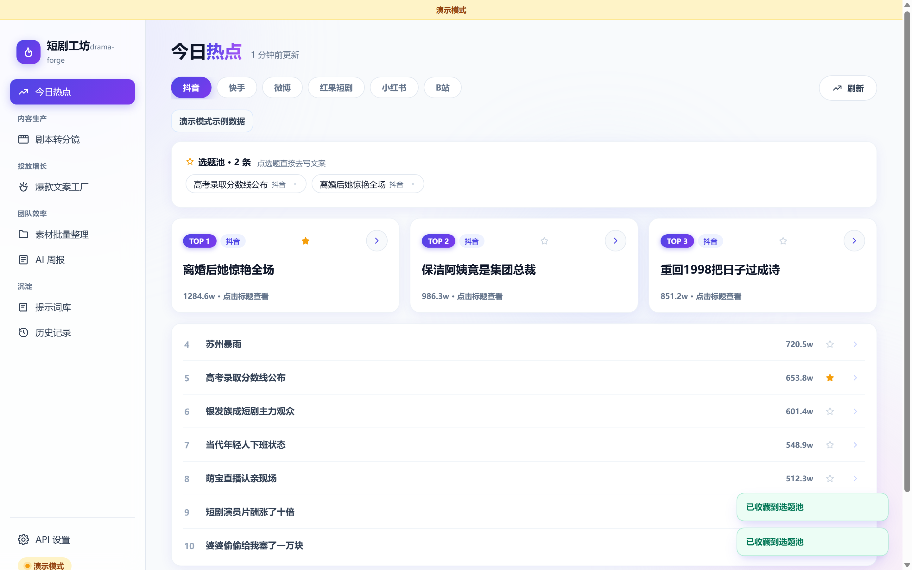
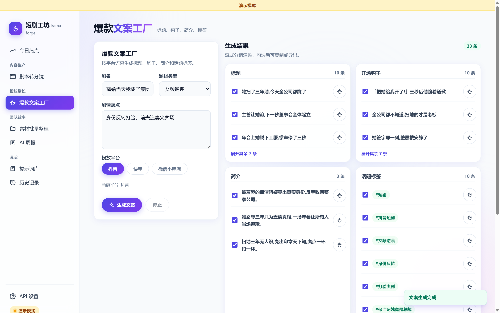
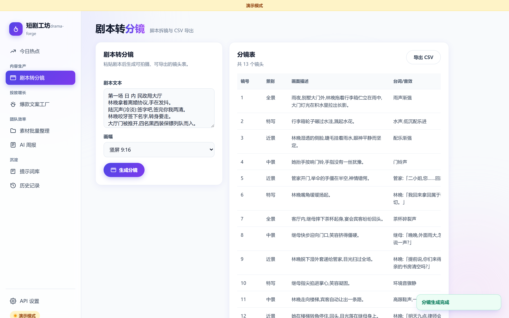
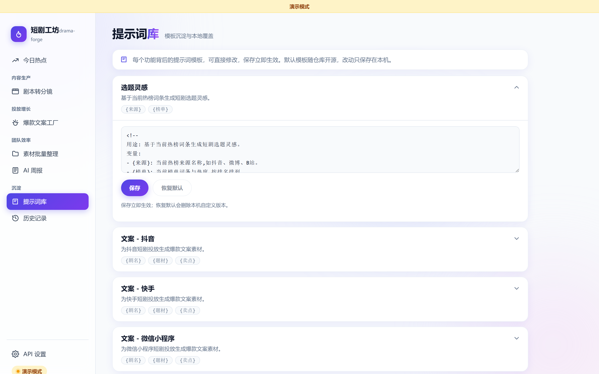
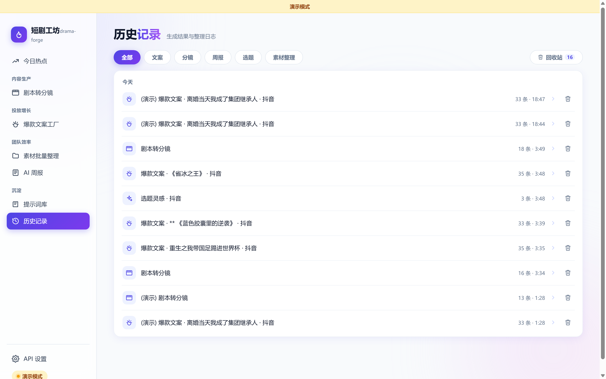

# 短剧工坊 drama-forge

围绕短剧「生产 — 投放 — 团队管理」三个环节的本地 AI 效率工具箱。零依赖 Node.js,克隆即用,不需要 `npm install`。

> 短剧行业的现状是:AI 把制作成本打下去了 90%,投流成本却翻倍上涨。效率工具的价值,就是让同样的预算测更多素材、更快迭代。这个项目就是围绕这个逻辑做的。

## 截图

| 今日热点 | 爆款文案工厂 |
| --- | --- |
|  |  |

| 剧本转分镜 | 提示词库 |
| --- | --- |
|  |  |

| 历史记录 |
| --- |
|  |

## 功能

**今日热点(首页)**
- 聚合 9 个热榜源:抖音、快手、微博、红果短剧、小红书、B站(默认开启),百度、头条、知乎(可选开启)
- 点击词条直接跳转对应平台搜索页看视频;30 分钟缓存,接口失败自动回退旧缓存
- 热点词条可一键收藏进选题池,按标题去重,点选题直接带入文案工厂继续写卖点
- AI 选题灵感:基于当天榜单生成 3 个短剧选题,一键带入文案工厂

**内容生产**
- 剧本转分镜:粘贴剧本,生成镜号/景别/画面/台词·音效/时长的完整分镜表,导出 CSV(Excel 直接打开中文不乱码)
- 文案到分镜:文案工厂里勾选前 3 秒钩子或简介后,一键带着剧名、题材、卖点和选中文案跳到分镜页

**投放增长**
- 爆款文案工厂:输入剧名、题材、卖点,流式生成 10 条标题 + 10 条前 3 秒钩子 + 3 条简介 + 1 组话题标签
- 抖音 / 快手 / 微信小程序三套平台风格,提示词层面真实差异化,可勾选、单条复制、批量导出 CSV

**团队效率**
- 素材批量整理:按拍摄日期或类型归类 + 模板化重命名,纯本地运行不需要联网。先预览后执行,自动记日志,支持一键撤销
- AI 周报:粘贴口水账,生成「本周完成 / 数据亮点 / 下周计划 / 风险」四段式周报,数字原样保留不编造

**沉淀**
- 提示词库:每个功能背后的提示词模板可直接在应用内查看、修改,保存立即生效,可一键恢复默认
- 历史记录:所有生成结果自动存档,可筛选、回看、再次导出;素材整理记录可从历史里撤销

**演示模式**
- 设置页一键开启,断网或未配 key 也能用内置示例数据完整走通所有功能(含假流式效果),适合演示和快速体验

## 快速开始

要求:Node.js ≥ 18(需要内置 fetch),不需要安装任何依赖。

```bash
git clone https://github.com/<你的用户名>/drama-forge.git
cd drama-forge
node server.js
```

然后打开 `http://127.0.0.1:3900`。Windows 用户也可以直接双击 `start.bat`。

**配置 AI(二选一):**

1. 有 key:到「API 设置」页,选择服务商预设(默认 DeepSeek,也支持 Kimi、通义千问或任何 OpenAI 兼容接口),填入你的 API Key,点「测试连接」通过后保存。DeepSeek key 在 [platform.deepseek.com](https://platform.deepseek.com) 注册即可获取,几块钱够用很久。
2. 没 key:到「API 设置」页打开「演示模式」,零配置体验全部功能。

## 架构

```
drama-forge/
├── server.js          # 唯一入口:静态服务 + /api/* 路由,只监听 127.0.0.1:3900
├── lib/
│   ├── ai.js          # OpenAI 兼容层:流式 SSE 转发、空闲超时、错误翻译成人话
│   ├── sources/       # 热榜源适配器,一个源一个文件,加新源 = 加一个文件
│   ├── cache.js       # 热榜缓存与降级
│   ├── files.js       # 素材整理:扫描/预览/执行/撤销,路径穿越防护,绝不删除文件
│   ├── history.js     # 生成历史存储(最多保留 200 条)
│   ├── pool.js        # 热点选题池:收藏、去重、删除,运行时写入 data/idea-pool.json
│   ├── prompts.js     # 提示词模板管理(默认版 + 用户覆盖版)
│   └── mock/          # 演示模式的全量示例数据
├── prompts/           # 提示词模板(本仓库的核心资产之一,见下文)
├── public/            # 前端:原生 HTML/CSS/JS,单页 hash 路由,无框架无构建
└── data/              # 运行时生成(配置/key/缓存/历史/选题池),已 gitignore,不进仓库
```

**几个设计决策:**

- **零依赖**:只用 Node 内置模块。任何人克隆下来 `node server.js` 就能跑,没有安装环节,也没有供应链风险。
- **key 安全**:API Key 只保存在本机 `data/config.json`(整个 `data/` 目录不进 git);浏览器端永远拿不到 key,所有对外请求由后端转发注入;服务只监听本机回环地址。
- **适配器模式**:热榜源、AI 服务商都是可插拔的。换模型只需要在设置页改预设;加热榜源只需要在 `lib/sources/` 加一个几十行的文件。
- **演示容错**:热点有缓存兜底,AI 有演示模式兜底,面向真实使用场景设计,而不是只能在理想网络下跑通的玩具。

## 提示词模板(prompts/)

每个 AI 功能的提示词都是一个独立的 markdown 文件,头部注释写明用途、变量和设计思路。它们既是代码,也是这个项目的方法论沉淀——为什么抖音文案要短句悬念前置、为什么分镜要强制 JSON 输出、为什么周报要求「数字原样保留不编造」,都写在里面。

模板可以在应用内的「提示词库」页直接编辑,保存立即生效;修改保存在本机 `data/prompts/`,不影响仓库里的默认版。

## 开发方式

本项目使用 Claude Code 与 Codex 辅助开发:先完成行业调研与设计文档,再按「设计文档 → 分阶段开工提示词 → 逐任务实现/自检/commit → 实跑验收」的循环分六个阶段建造,全程 110 个自动化测试保障。完整的开发方法论与各阶段记录见 [docs/build-log.md](docs/build-log.md)。

## License

[MIT](LICENSE)
